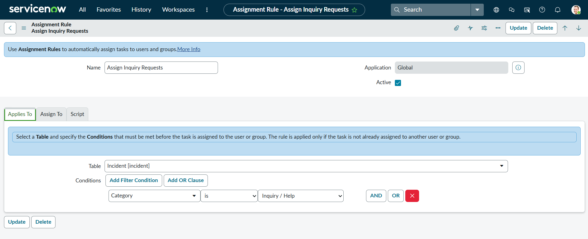
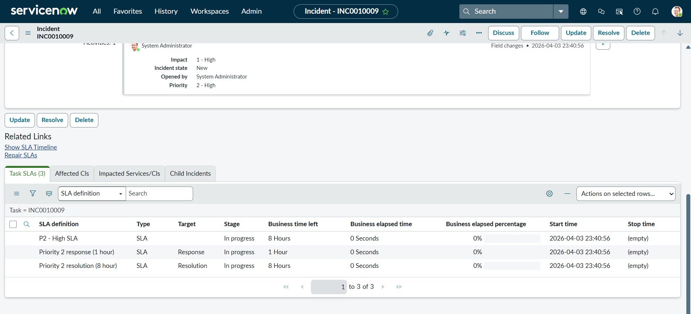
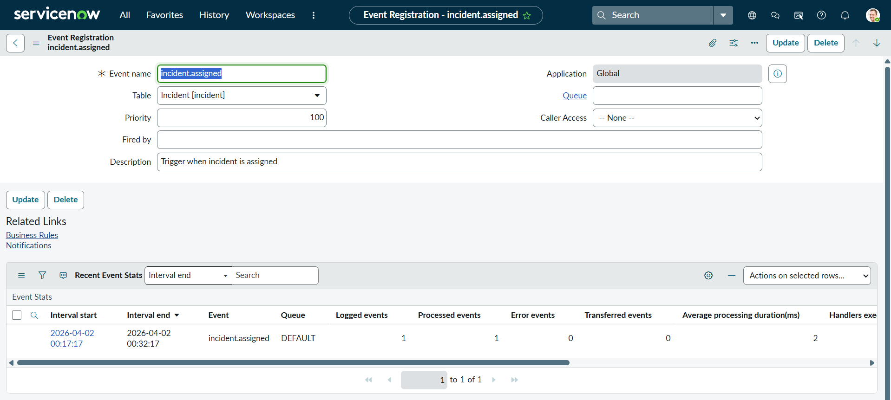
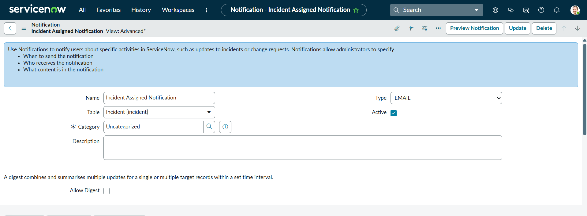
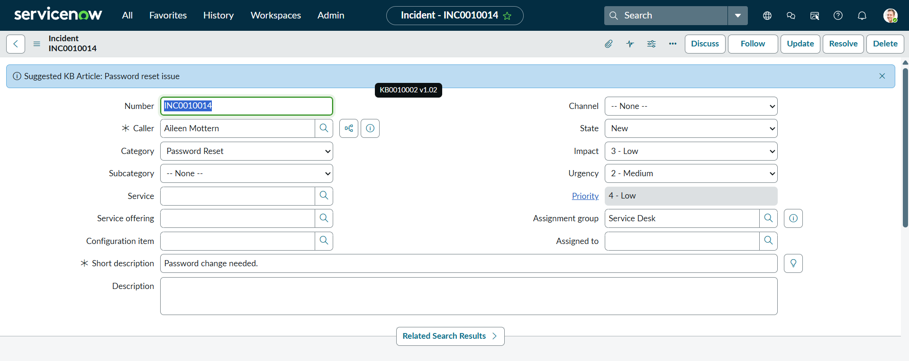
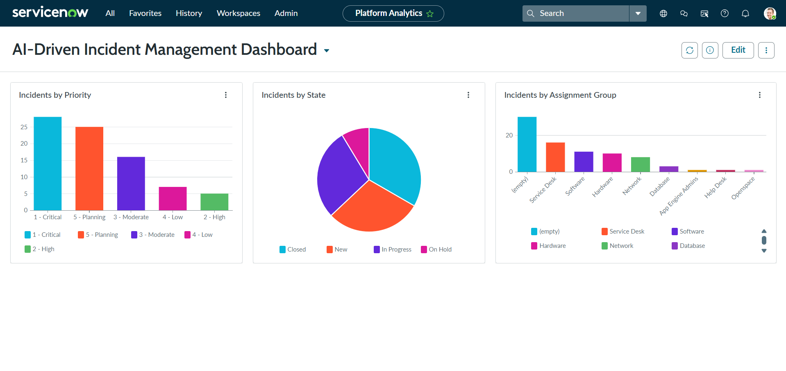

# 🚀 AI-Driven Incident Management System (ServiceNow)

## 📌 Overview
This project demonstrates the implementation of an end-to-end Incident Management system using ServiceNow. It includes automation, SLA tracking, event-driven notifications, and intelligent knowledge base suggestions to improve incident resolution efficiency.

---

## 🎯 Key Features

- 🔄 Automated Incident Assignment using Assignment Rules
- ⏱️ SLA Management with Start, Pause, and Stop Conditions
- 📧 Event-Driven Email Notifications using Business Rules
- 🤖 Knowledge Base Recommendation System (AI-like feature)
- 📊 Interactive Dashboard for Incident Monitoring

---

## 🧩 Modules Used

- Incident Management
- SLA Management
- Knowledge Management
- Notifications & Event Registry
- Reporting & Dashboard

---

## ⚙️ Implementation Details

### 🔹 1. Assignment Rules
Configured rules to auto-assign incidents based on category:

- Network → Network Team  
- Hardware → Hardware Team  
- Software → Software Team  
- Password Reset → IAM Team  

---

### 🔹 2. SLA Configuration

Defined SLAs based on priority:

- P1 (Critical) → 4 hours  
- P2 (High) → 8 hours  
- P3 (Moderate) → 24 hours  
- P4 (Low) → 48 hours  

Additional configurations:
- Business Hours Schedule (8–5 weekdays excluding holidays)
- Stop Condition → Resolved / Closed
- Pause Condition → On Hold

---

### 🔹 3. Notifications & Events

- Created custom event: `incident.assigned`
- Triggered using Business Rule when assignment group changes
- Email notification sent to assigned user

#### Event Script:
```javascript
gs.eventQueue("incident.assigned", current, current.assigned_to, "");
```

---

### 🔹 4. Knowledge Base Suggestion (AI Feature)

The system suggests relevant KB articles based on keywords from incident description.
```javascript
if (!current.short_description.nil()) {
    var keyword = current.short_description.toString().split(" ")[0];

    var gr = new GlideRecord('kb_knowledge');
    gr.addQuery('short_description', 'CONTAINS', keyword);
    gr.query();

    if (gr.next()) {
        gs.addInfoMessage("Suggested KB Article: " + gr.short_description);
    }
}
```

---

### 🔹 5. Dashboard & Reports

Created dashboard: AI-Driven Incident Management Dashboard

Reports included:

- Incidents by Priority
- Incidents by State
- Incidents by Assignment Group


---

### 📸 Screenshots
### 🔹 Assignment Rules


---

### 🔹 SLA


---

### 🔹 Event


---

### 🔹 Notification


---

### 🔹 Knowledge Suggestion


---

### 🔹 Dashboard



